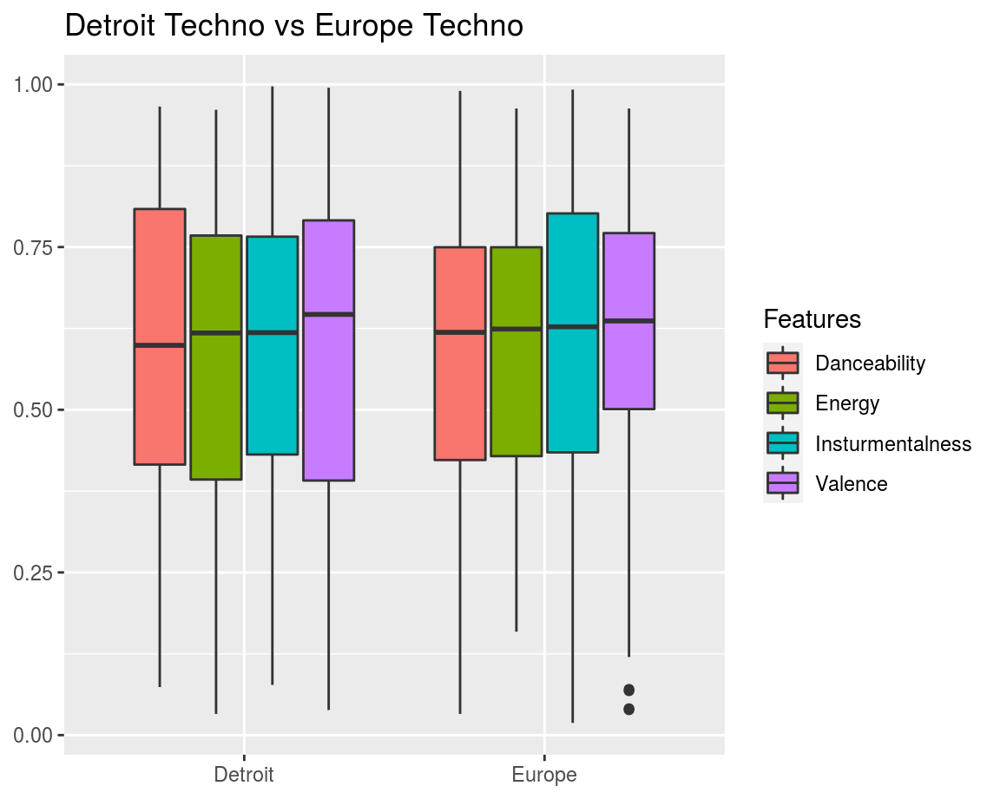
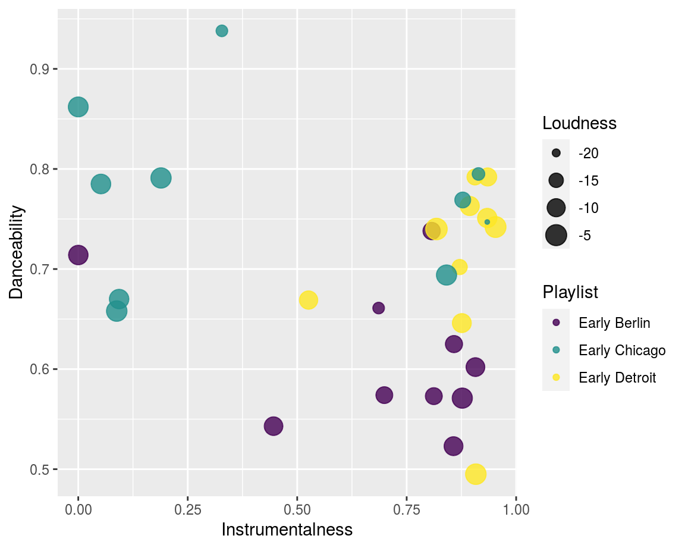
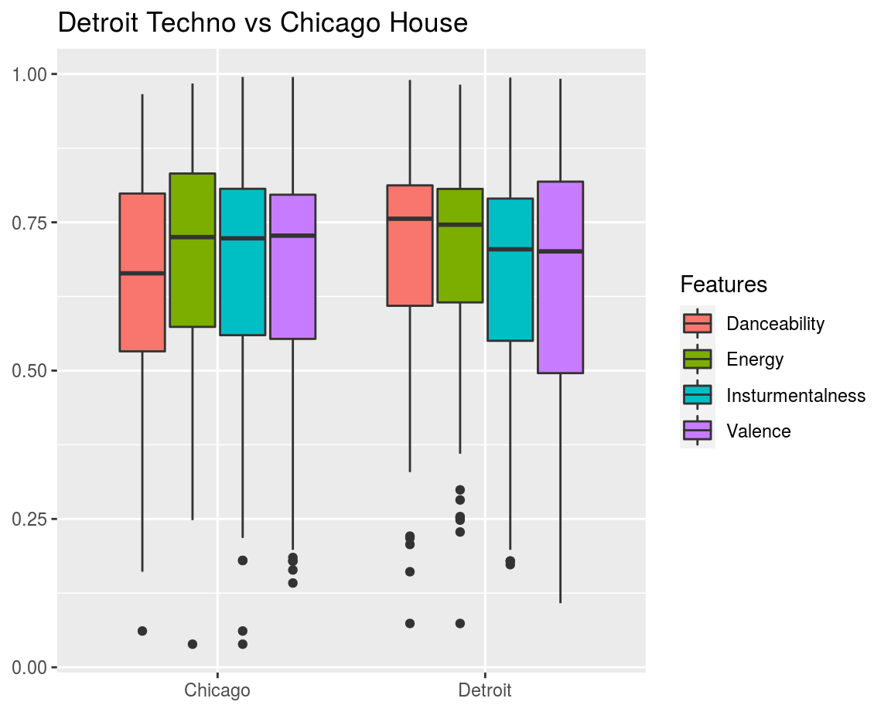
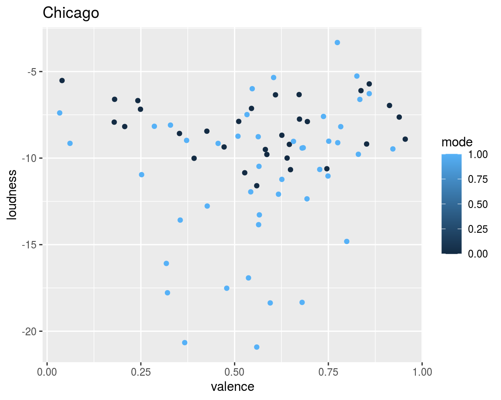
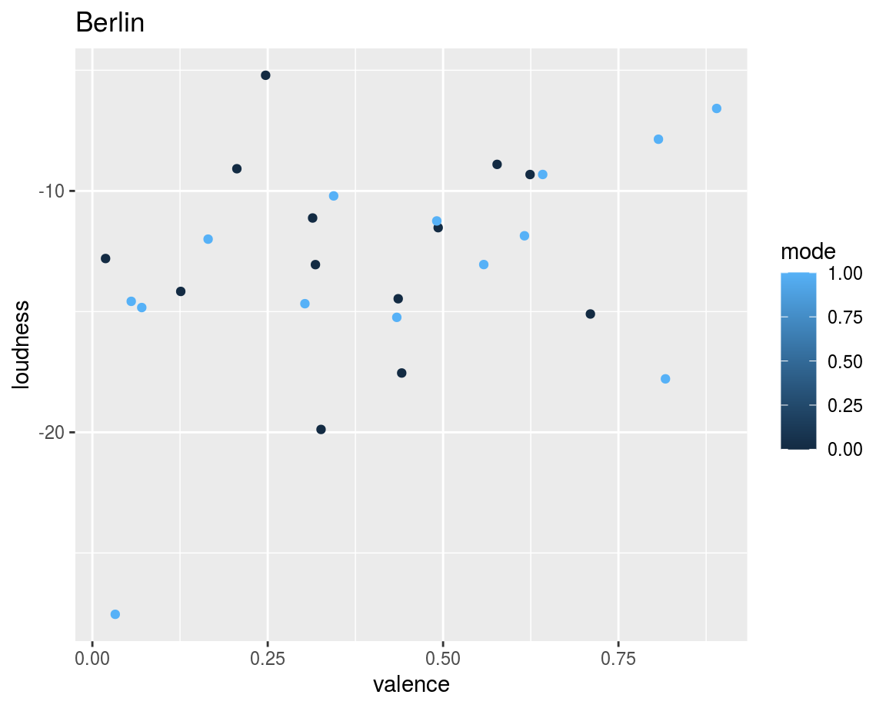
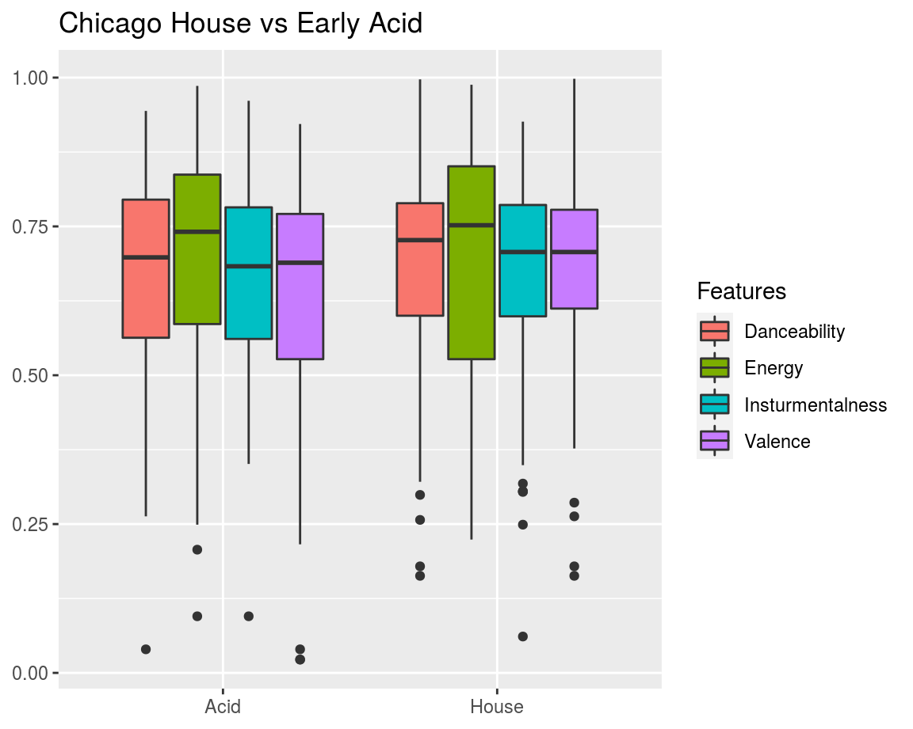

<div class="knitr-options" data-fig-width="576" data-fig-height="460"></div>


Introduction
=========================================

** Intro still in progress... 

I will be exploring the genre of techno and house. 
Techno emerged in the late 80's from the wide availability of synthesizers and the inspiration of early electronic music artist like Kraftwerk, Giorgio Mordor, Depech Mode, Front 242. 
The techno seed sprouted at about the same time in America and Europe. 
Chicago was the home of house and acid house, centering around Trax Records.
Detriot was the home of techno with many founding fathers including Juan Atkins, Derrick May, Jeff Mills. They owned MetroPlex, Transmat Records and UR Records respectively. 
Techno and house in Europe had its strong beginnings in Germany with hot pockets in Belguim and UK. Tresor Records in Berlin and R&S Records in Ghent ignited the techno flame. 

My corpus, for now, consists of three playlists - Detriot, Chicago, Europe(berlin). I looked at the record releases from the above mentioned labels, from first releases at around 1987 until about 1993, and searched for available tracks on Spotify. 

From its inception until early 1990's, there is clear geographical comparison to look at - Detriot Techno vs Berlin Techno. After 1993 or so, many Detriot founders move to Berlin. 
There is also a clear comparison between Chicago Acid House and Berlin/Detroit Techno


If space and scope permit, I would also like to look at the comparison between early techno and proto-techno (late 70's and 80's), as well as early techno and current techno.

<div class="knitr-options" data-fig-width="576" data-fig-height="460"></div>

Visualizations {.storyboard}
=========================================

### Classification

<div class="knitr-options" data-fig-width="576" data-fig-height="460"></div>


```
# A tibble: 3 x 3
  class         precision recall
  <fct>             <dbl>  <dbl>
1 Early Berlin      0.429    0.3
2 Early Chicago     0.636    0.7
3 Early Detroit     0.25     0.3
```



***

Commentary Here

### Danceability vs Energy 

<div class="knitr-options" data-fig-width="576" data-fig-height="460"></div>


***

Commentary Here

### Valence vs Loudness

<div class="knitr-options" data-fig-width="576" data-fig-height="460"></div>


***

Commentary Here

### Chrome Features Chromagram + DTW

<div class="knitr-options" data-fig-width="576" data-fig-height="460"></div>


***

Commentary Here

### Ceptogram + SSM

<div class="knitr-options" data-fig-width="576" data-fig-height="460"></div>


***

In this section, I will compare four tracks: Acid House vs. Chicag House and Berlin Techni vs Detroit Techno 

### Chordogram

<div class="knitr-options" data-fig-width="576" data-fig-height="460"></div>


***

Here, I will look at...

### Novelty Function:Loudness & Tempogram 

<div class="knitr-options" data-fig-width="576" data-fig-height="460"></div>


***

Commentary Here

### Loudness

<div class="knitr-options" data-fig-width="576" data-fig-height="460"></div>


***

Commentary Here


### Chart 3

<div class="knitr-options" data-fig-width="576" data-fig-height="460"></div>


***

Commentary Here

### Chart 3

<div class="knitr-options" data-fig-width="576" data-fig-height="460"></div>


***

Commentary Here

### Chart 3

<div class="knitr-options" data-fig-width="576" data-fig-height="460"></div>


***

Commentary Here


Discussion
=========================================

Discussion Here


