<div class="knitr-options" data-fig-width="576" data-fig-height="460"></div>


Introduction
=========================================

Ever since moving to Amsterdam 7 years ago, I’ve been in the midst of a techno love affair. The bass enveloped me, the beat hypnotized me and the high hat had me twirling till dawn. As much as my familiarity has expanded over the years, I haven’t really delved into its origins and explored its roots. This project has provided me the opportunity to do so.  In particular, I will explore sub-genres of Techno, House and Acid; gain insights about their similarities and differences at the genre and track level.  

The techno seed sprouted at about the same time in America and Europe in the late 80’s thanks to the wide availability of synthesizers and drum machines. Artist took their inspirations from early electronic musicians like Kraftwerk, Giorgio Mordor, and Depeche Mode. Chicago is known as the home of house music, getting its name from “bedroom style” production and evolving from the dying disco era, with funky groove, piano riffs and catchy chorus. The industrial landscape of Detroit inspired the rougher, faster and futuristic sound of techno. Across the pond, the rave scene in Germany, Netherlands, Belgium and UK was exploding and expanding the variants of techno and acid, as well as house.  

To compile the project corpus, I searched for techno and house record labels that began in the late 80’s/early 90’s and searched for available tracks on Spotify. I created four playlists:  


<a href = "https://open.spotify.com/playlist/1YnOhBchUwaRFOqzWZp4CV?si=hc-Wa8lHQMGkIxTfyKyMyA"> Early Europe Techno </a> 

Tresor Records: Berlin, 1991 

R&S Records: Ghent, 1983 

Djax-Up-Beat Records: Eindhoven, 1989 

Rising High Records: London, 1991 


<a href = "https://open.spotify.com/playlist/7zJxmBOEVValZYC0zmfLrf?si=2VKWRtBwSpKEWkSSabgM9w"> Early Detroit Techno </a>

Underground Resistance Records: 1990 

Transmat Records: 1986  

Metroplex: 1985  


<a href = "https://open.spotify.com/playlist/3CnYQrWpRhyWqYmoUyQdtY?si=VoWP3226Svehn5Tlai4zWQEarly"> Chicago House </a> 

Trax Records: 1984 


<a href = "https://open.spotify.com/playlist/3CnYQrWpRhyWqYmoUyQdtY?si=VoWP3226Svehn5Tlai4zWQEarly">  Chicago House </a>  

Trax Records: 1984 

<a href = "https://open.spotify.com/playlist/1Ybjwa5pLtVCqlXrIrOOiF?si=eMeDPBgtQ_a_2sVrqi4LRw"> Early Acid </a> 


Mix of labels above  


Spotify user : natzaw

<div class="knitr-options" data-fig-width="576" data-fig-height="460"></div>

Visualizations {.storyboard}
=========================================

### Europe Techno Vs Detriot Techno 

<div class="knitr-options" data-fig-width="576" data-fig-height="460"></div>


```
[1] 0.532 0.415 0.651 0.282 0.854 0.817
```


```
 num [1:80] 0.532 0.415 0.651 0.282 0.854 0.817 0.426 0.221 0.386 0.161 ...
```

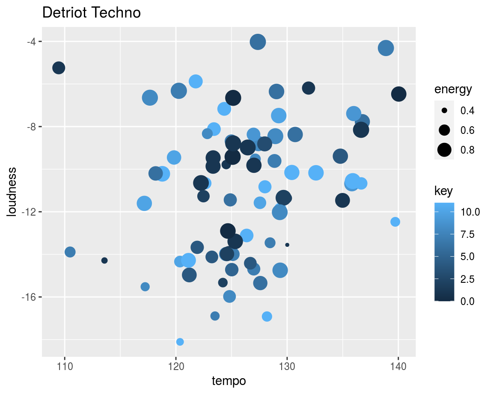

***

As expected, techno in Detroit and Europe are quite similar. Danceability are valence factors are roughly the same, giving the rave parties similar vibes in both regions. Detroit has slightly more median energy but lower instrumentalness.  

European techno has more consistent tempo between 120 –125 bpm and more consistent loudness centering around –10 db. It also interesting to see here that the outliers have higher key values of above 8 and generally lower energy values.  

Detroit techno has greater bpm spread with several tracks going above 130 bmp and a few hovering around 110. Loudness also has slighter greater spread and more tracks passing the –15 db threshold. In contrast to European techno, the outliers tend to have lower key values and higher key values.


### Detroit Techno Vs Chicago House 

<div class="knitr-options" data-fig-width="576" data-fig-height="460"></div>


***

Chicago house is slightly greater danceability factor and greater positive emotional valence reflecting its disco and funk roots. Detroit techno has more energy and on average, less vocals, however it’s interesting to see that Chicago has more instrumental outliers on the lower spectrum considering that usually house has more vocals  

Chicago house has more consistent tempo between 120 –125 bpm and a few outliers that are mostly all in higher keys compared to Detroit techno. It has a slightly wider spread of bpm with many tracks over 130 bpm and a range of key values in outlier positions.  


### Chicago House Vs Early Acid  

<div class="knitr-options" data-fig-width="576" data-fig-height="460"></div>
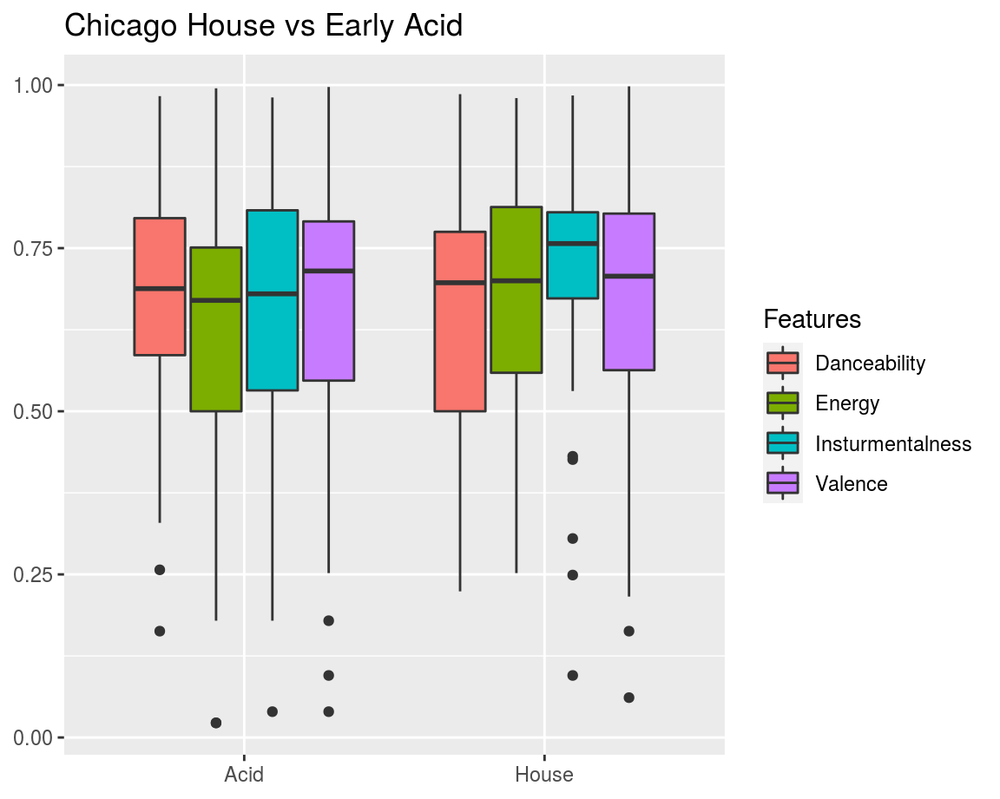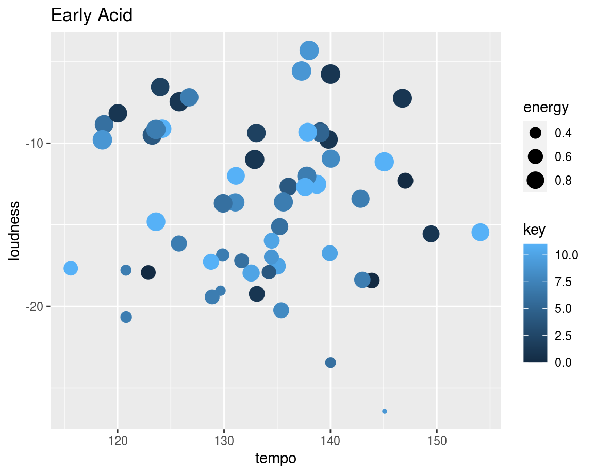

***

This boxplot surprised me a bit. The features are more similar than I expected. Because of its harsher sound, acid valence and instrumentalness is higher than I thought and would not expect it to surpass house, although it does have more outliers on the low spectrum. Acid danceability is lower than house which make sense due to house’s funk and disco roots. 

Acid has a much higher average bpm, around 135, in a variety of key values however there is a clear pattern where higher energy indicated higher loudness and lower key on average.   


### Chroma Features: Techno vs House vs Acid 

<div class="knitr-options" data-fig-width="576" data-fig-height="460"></div>
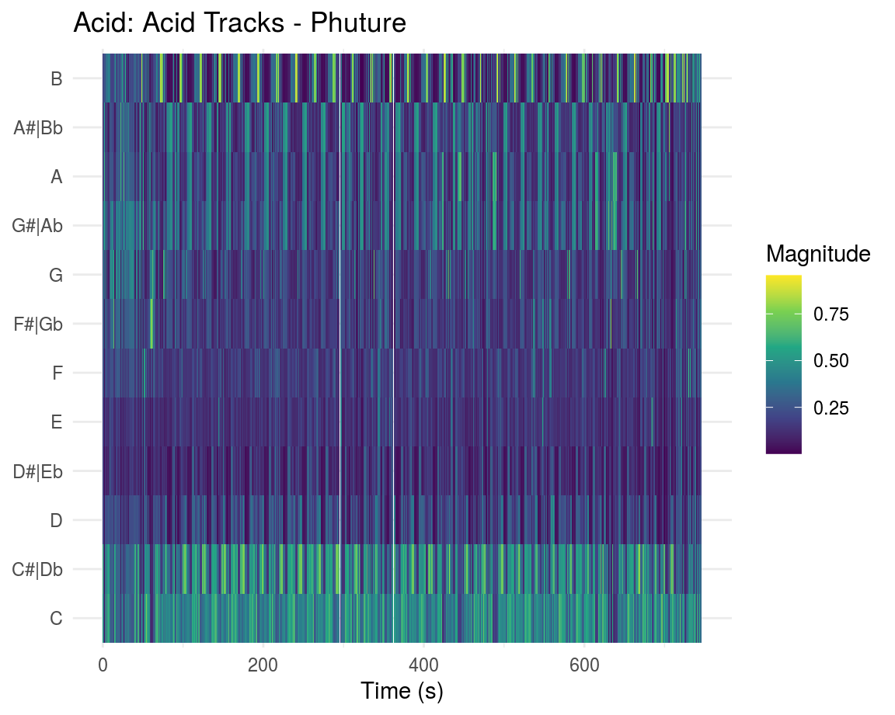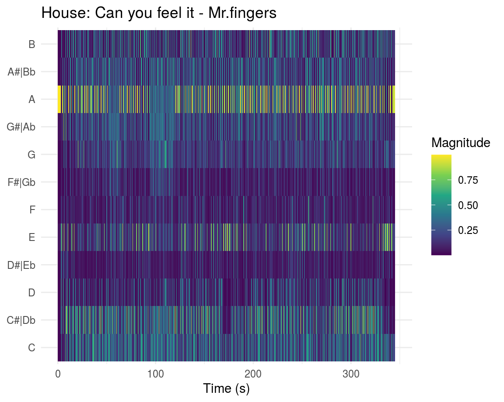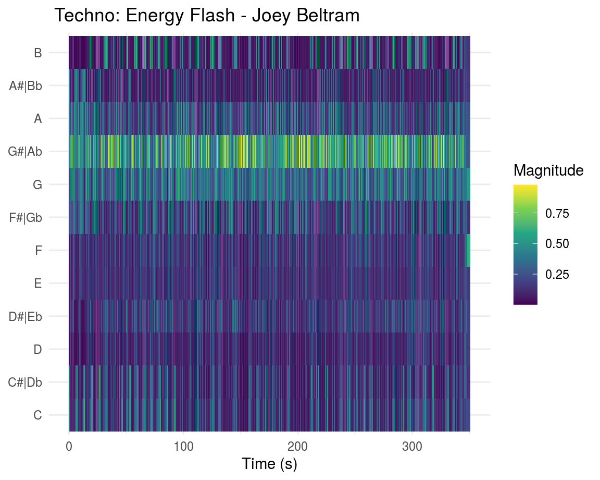

***

Here I looked at three popular tracks of each genre.  

The <a href = "https://open.spotify.com/track/63eiF9VouGtmhiBKjm1LHU?si=8TDGwTmJTIOoMdcwVod5ZA"> acid track </a> has a clear C, C# and B chroma pattern which was interesting to see considering the main sound feature of acid is the oscillating synth chord that I expected would be difficult for spotify to define.  

The <a href = "https://open.spotify.com/track/5479eh8cRkMdukYI3gtO36?si=cWIiBAPQRRev5CTGnVmsFw"> house track </a> has predominately A pitch class that I think is attributed to the bassline.  

The <a href = "https://open.spotify.com/track/46ddej1ibGIgs58H0wakoK?si=cXY5J-nJSZSaorZdgaL55g"> techno track </a> has mainly G3 pitch class most likely attributed to the bassline as well. I thought the synth cord that comes in at 0:45 sec would be identifiable but I could not place it in the chromagram.  

### Ceptogram + SSM: Techno vs House

<div class="knitr-options" data-fig-width="576" data-fig-height="460"></div>
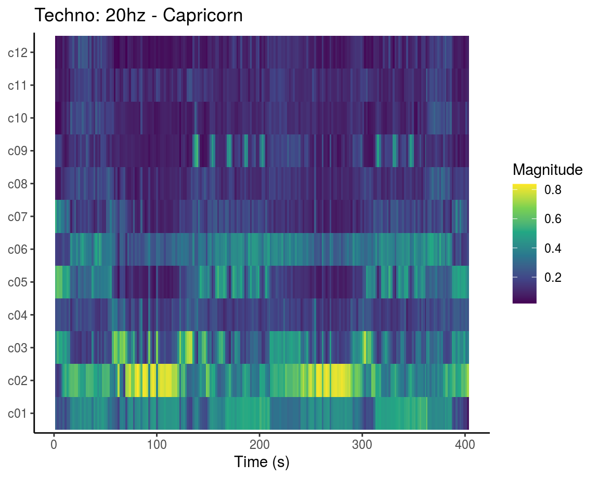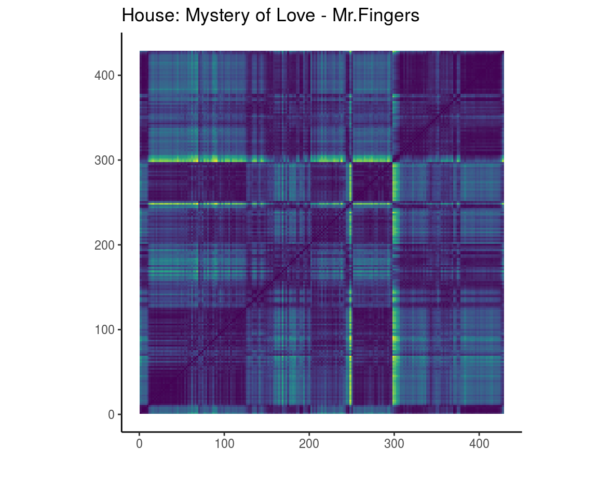

***

Here I looked at a popular <a href = "https://open.spotify.com/track/1ndmrtMTVTFLRYb0RPo36k?si=O7tmelrzRHOQxLd9Djn2Xg"> techno </a> and <a href = "https://open.spotify.com/track/6AvtRMA6AzFNYZ3qEMYpch?si=oyAz8jzBRT6dzicmMBIrvA"> house track </a> to compare timbre features.  

The most prominent feature of the techno track is the loud Brazilian batucada percussion that drop in two sections which shows up as strong c02 vibrance. Between these sections is a panning synth that seems to shows up in c05 and /or c09.  

The house track has less concentrated timbre features with a few highlights at around 250 and 300 seconds.   

The self-similarity matrices show that the techno has slightly less repetition than the house track which makes sense in that the techno track has several distinguishing segments while the house tracks is rather repetitive. The two bright seem to corresponds with a clear break in the tracks where the piano chords go a little whack.  

### Keygram Tonal Analysis

<div class="knitr-options" data-fig-width="576" data-fig-height="460"></div>


***

<a href = "https://open.spotify.com/track/6bzV0xGO4dROmmL9GmVkjM?si=8IuWBrXoRSCtm974r7pI9g"> “Go” by Moby </a> is popular techno track released in 1992. When I first heard the track, I recognized the beginning chords from the song <a href = "https://open.spotify.com/track/7Bk3p8UqcP4sItaWNWbvXL?si=5VLCKWIATH2Qfudt5yEV0A"> “Laura’s Theme” </a> from the series Twin Peaks. I was curious to see if the keygram will pick up the similarities. “Go” does register the chords, D flat major, F sharp minor and D# minor, at the beginning and middle of the track when they are they are the only sounds playing. When comparing to “Laura’s theme” however, the chords don’t seem to align quite right, except at the last section of the song.  

I was surprised to see that the acid track <a href = "https://open.spotify.com/track/63eiF9VouGtmhiBKjm1LHU?si=NtjICCWcQ021mZ3zxJqPLw"> “Acid Tracks” </a> registered clearer tones than house track <a href = "https://open.spotify.com/track/6AvtRMA6AzFNYZ3qEMYpch?si=nQN0ewjOQOmTdBqD2vhGKA"> “Mystery of Love” </a> considering the wide oscillation of the acid synth compared to the rather structured composition of the house tracks.  

I was interested to see what the keygram would pick up from the segmented house/acid track <a href = "https://open.spotify.com/track/4kbzPGFkJPzCWrNOJXKVi0?si=SrrdkiJKTDi4xPts3Ekmqw"> “House is Mine” </a>. I did not expect that the middle acid section would be have higher tonal energy than the beginning and end house section. But this result would align with the observation above.  

### Novelty Function & Ceptogram: House is Mine 

<div class="knitr-options" data-fig-width="576" data-fig-height="460"></div>
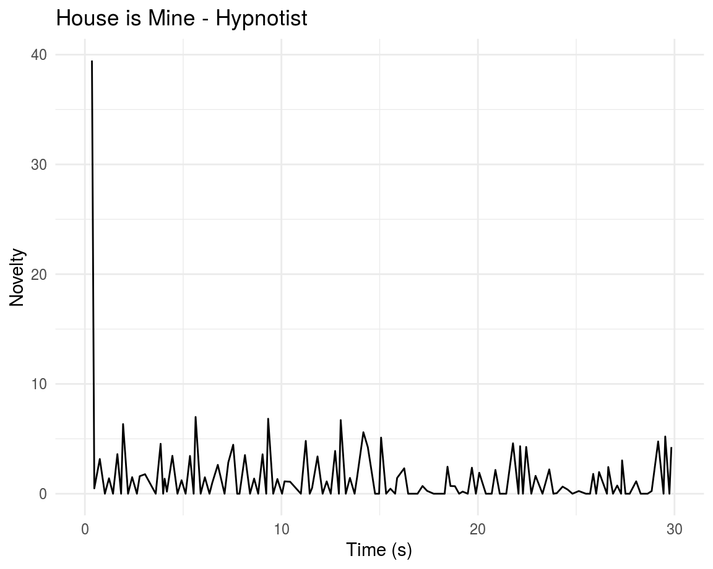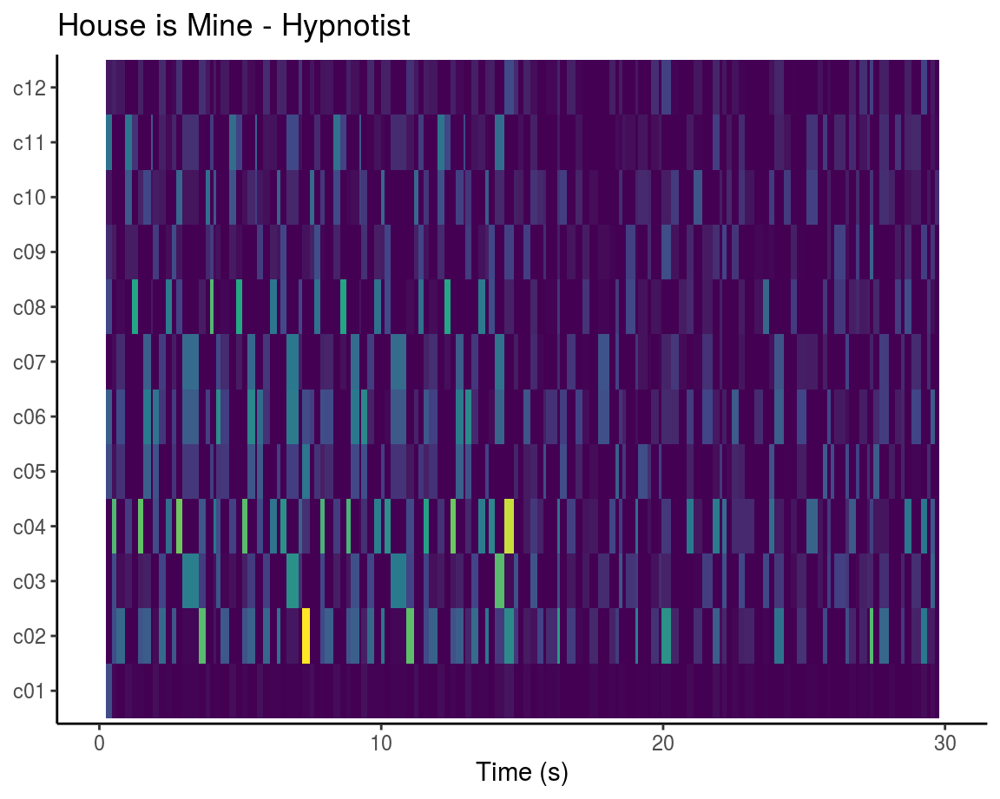

***

Commentary Here

### Loudness

<div class="knitr-options" data-fig-width="576" data-fig-height="460"></div>


***

Commentary Here

### Classification

<div class="knitr-options" data-fig-width="576" data-fig-height="460"></div>


```
# A tibble: 3 x 3
  class         precision recall
  <fct>             <dbl>  <dbl>
1 Early Berlin      0.636    0.7
2 Early Chicago     0.667    0.8
3 Early Detroit     0.429    0.3
```

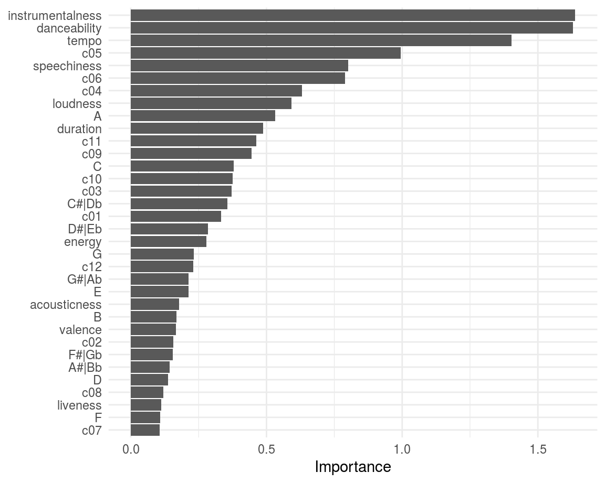

***

Commentary Here


### Chart 3

<div class="knitr-options" data-fig-width="576" data-fig-height="460"></div>


```
tibble [1 × 13] (S3: tbl_df/tbl/data.frame)
 $ analyzer_version         : chr "4.0.0"
 $ duration                 : num 746
 $ end_of_fade_in           : num 0.305
 $ start_of_fade_out        : num 734
 $ tempo_confidence         : num 0.799
 $ time_signature_confidence: num 1
 $ key_confidence           : num 0.13
 $ mode_confidence          : num 0.212
 $ bars                     :List of 1
  ..$ : tibble [371 × 3] (S3: tbl_df/tbl/data.frame)
  .. ..$ start     : num [1:371] 0.823 2.86 4.882 6.902 8.92 ...
  .. ..$ duration  : num [1:371] 2.04 2.02 2.02 2.02 2.02 ...
  .. ..$ confidence: num [1:371] 0.706 0.719 0.711 0.488 0.646 0.332 0.622 0.62 0.676 0.637 ...
 $ beats                    :List of 1
  ..$ : tibble [1,471 × 3] (S3: tbl_df/tbl/data.frame)
  .. ..$ start     : num [1:1471] 0.823 1.334 1.843 2.351 2.86 ...
  .. ..$ duration  : num [1:1471] 0.511 0.509 0.508 0.508 0.507 ...
  .. ..$ confidence: num [1:1471] 0.952 0.94 0.918 0.971 0.956 0.946 0.937 0.968 0.938 0.93 ...
 $ tatums                   :List of 1
  ..$ : tibble [2,942 × 3] (S3: tbl_df/tbl/data.frame)
  .. ..$ start     : num [1:2942] 0.823 1.078 1.334 1.588 1.843 ...
  .. ..$ duration  : num [1:2942] 0.255 0.255 0.255 0.255 0.254 ...
  .. ..$ confidence: num [1:2942] 0.952 0.952 0.94 0.94 0.918 0.918 0.971 0.971 0.956 0.956 ...
 $ sections                 :List of 1
  ..$ : tibble [28 × 12] (S3: tbl_df/tbl/data.frame)
  .. ..$ start                    : num [1:28] 0 17.5 49.2 62.3 82.9 ...
  .. ..$ duration                 : num [1:28] 17.5 31.7 13.1 20.7 59 ...
  .. ..$ confidence               : num [1:28] 1 0.738 0.867 0.846 0.737 0.757 0.908 0.713 0.082 0.073 ...
  .. ..$ loudness                 : num [1:28] -14.2 -12.9 -13.9 -12.3 -10 ...
  .. ..$ tempo                    : num [1:28] 119 119 119 119 119 ...
  .. ..$ tempo_confidence         : num [1:28] 0.851 0.861 0.914 0.837 0.667 0.746 0.554 0.61 0.609 0.727 ...
  .. ..$ key                      : int [1:28] 1 6 6 6 8 9 4 4 8 0 ...
  .. ..$ key_confidence           : num [1:28] 0 0.045 0.638 0.163 0.549 0.006 0 0 0.04 0.157 ...
  .. ..$ mode                     : int [1:28] 1 1 1 0 0 1 1 1 0 1 ...
  .. ..$ mode_confidence          : num [1:28] 0 0.367 0.415 0.295 0.42 0.231 0 0 0.316 0.36 ...
  .. ..$ time_signature           : int [1:28] 4 4 4 4 4 4 4 4 4 4 ...
  .. ..$ time_signature_confidence: num [1:28] 1 1 1 1 1 1 1 1 1 1 ...
 $ segments                 :List of 1
  ..$ : tibble [4,778 × 9] (S3: tbl_df/tbl/data.frame)
  .. ..$ start            : num [1:4778] 0 0.305 0.814 1.338 1.796 ...
  .. ..$ duration         : num [1:4778] 0.305 0.508 0.524 0.459 0.295 ...
  .. ..$ confidence       : num [1:4778] 0 1 1 1 1 1 1 1 1 1 ...
  .. ..$ loudness_start   : num [1:4778] -60 -60 -45.5 -44.9 -46.5 ...
  .. ..$ loudness_max_time: num [1:4778] 0 0.0307 0.0293 0.0153 0.0624 ...
  .. ..$ loudness_max     : num [1:4778] -60 -7.33 -8.13 -8.23 -8.33 ...
  .. ..$ loudness_end     : num [1:4778] 0 0 0 0 0 0 0 0 0 0 ...
  .. ..$ pitches          :List of 4778
  .. .. ..$ : Named num [1:12] 0.937 1 0.308 0.322 0.307 0.342 0.341 0.3 0.25 0.197 ...
  .. .. .. ..- attr(*, "names")= chr [1:12] "C" "C#|Db" "D" "D#|Eb" ...
  .. .. ..$ : Named num [1:12] 0.691 0.674 0.457 0.323 0.411 0.643 0.789 1 0.98 0.607 ...
  .. .. .. ..- attr(*, "names")= chr [1:12] "C" "C#|Db" "D" "D#|Eb" ...
  .. .. ..$ : Named num [1:12] 0.675 0.647 0.457 0.312 0.41 0.642 0.796 1 0.996 0.582 ...
  .. .. .. ..- attr(*, "names")= chr [1:12] "C" "C#|Db" "D" "D#|Eb" ...
  .. .. ..$ : Named num [1:12] 0.674 0.674 0.508 0.393 0.451 0.627 0.8 0.99 1 0.624 ...
  .. .. .. ..- attr(*, "names")= chr [1:12] "C" "C#|Db" "D" "D#|Eb" ...
  .. .. ..$ : Named num [1:12] 1 0.869 0.481 0.049 0.209 0.472 0.362 0.117 0.283 0.149 ...
  .. .. .. ..- attr(*, "names")= chr [1:12] "C" "C#|Db" "D" "D#|Eb" ...
  .. .. ..$ : Named num [1:12] 0.122 0.061 0.046 0.023 0.043 0.037 0.066 0.275 0.849 1 ...
  .. .. .. ..- attr(*, "names")= chr [1:12] "C" "C#|Db" "D" "D#|Eb" ...
  .. .. ..$ : Named num [1:12] 0.684 0.656 0.462 0.309 0.396 0.614 0.782 1 0.966 0.609 ...
  .. .. .. ..- attr(*, "names")= chr [1:12] "C" "C#|Db" "D" "D#|Eb" ...
  .. .. ..$ : Named num [1:12] 0.655 0.669 0.538 0.335 0.417 0.591 0.837 1 0.968 0.591 ...
  .. .. .. ..- attr(*, "names")= chr [1:12] "C" "C#|Db" "D" "D#|Eb" ...
  .. .. ..$ : Named num [1:12] 0.583 0.503 0.448 0.354 0.359 0.495 0.71 1 0.842 0.464 ...
  .. .. .. ..- attr(*, "names")= chr [1:12] "C" "C#|Db" "D" "D#|Eb" ...
  .. .. ..$ : Named num [1:12] 1 0.891 0.424 0.119 0.176 0.311 0.259 0.08 0.23 0.163 ...
  .. .. .. ..- attr(*, "names")= chr [1:12] "C" "C#|Db" "D" "D#|Eb" ...
  .. .. ..$ : Named num [1:12] 0.48 0.095 0.068 0.036 0.065 0.08 0.102 0.057 0.064 0.129 ...
  .. .. .. ..- attr(*, "names")= chr [1:12] "C" "C#|Db" "D" "D#|Eb" ...
  .. .. ..$ : Named num [1:12] 0.577 0.062 0.029 0.038 0.059 0.071 0.087 0.063 0.06 0.13 ...
  .. .. .. ..- attr(*, "names")= chr [1:12] "C" "C#|Db" "D" "D#|Eb" ...
  .. .. ..$ : Named num [1:12] 0.548 0.617 0.456 0.428 0.399 0.589 0.715 1 0.935 0.528 ...
  .. .. .. ..- attr(*, "names")= chr [1:12] "C" "C#|Db" "D" "D#|Eb" ...
  .. .. ..$ : Named num [1:12] 0.819 0.807 0.532 0.228 0.367 0.728 0.842 0.848 1 0.773 ...
  .. .. .. ..- attr(*, "names")= chr [1:12] "C" "C#|Db" "D" "D#|Eb" ...
  .. .. ..$ : Named num [1:12] 1 0.922 0.699 0.272 0.353 0.741 0.625 0.337 0.429 0.319 ...
  .. .. .. ..- attr(*, "names")= chr [1:12] "C" "C#|Db" "D" "D#|Eb" ...
  .. .. ..$ : Named num [1:12] 0.273 0.315 0.196 0.17 0.167 0.212 1 0.877 0.238 0.236 ...
  .. .. .. ..- attr(*, "names")= chr [1:12] "C" "C#|Db" "D" "D#|Eb" ...
  .. .. ..$ : Named num [1:12] 1 0.926 0.415 0.157 0.188 0.278 0.251 0.092 0.25 0.199 ...
  .. .. .. ..- attr(*, "names")= chr [1:12] "C" "C#|Db" "D" "D#|Eb" ...
  .. .. ..$ : Named num [1:12] 0.193 0.103 0.063 0.056 0.065 0.057 0.086 0.283 0.783 1 ...
  .. .. .. ..- attr(*, "names")= chr [1:12] "C" "C#|Db" "D" "D#|Eb" ...
  .. .. ..$ : Named num [1:12] 0.714 0.713 0.512 0.299 0.378 0.642 0.767 0.969 1 0.664 ...
  .. .. .. ..- attr(*, "names")= chr [1:12] "C" "C#|Db" "D" "D#|Eb" ...
  .. .. ..$ : Named num [1:12] 1 0.906 0.447 0.149 0.186 0.306 0.266 0.101 0.226 0.202 ...
  .. .. .. ..- attr(*, "names")= chr [1:12] "C" "C#|Db" "D" "D#|Eb" ...
  .. .. ..$ : Named num [1:12] 1 0.717 0.668 0.604 0.35 0.452 0.413 0.538 0.42 0.35 ...
  .. .. .. ..- attr(*, "names")= chr [1:12] "C" "C#|Db" "D" "D#|Eb" ...
  .. .. ..$ : Named num [1:12] 1 0.965 0.78 0.693 0.734 0.479 0.622 0.666 0.535 0.597 ...
  .. .. .. ..- attr(*, "names")= chr [1:12] "C" "C#|Db" "D" "D#|Eb" ...
  .. .. ..$ : Named num [1:12] 0.61 0.656 0.501 0.443 0.442 0.614 0.762 1 0.911 0.567 ...
  .. .. .. ..- attr(*, "names")= chr [1:12] "C" "C#|Db" "D" "D#|Eb" ...
  .. .. ..$ : Named num [1:12] 1 0.928 0.437 0.171 0.188 0.272 0.248 0.102 0.257 0.208 ...
  .. .. .. ..- attr(*, "names")= chr [1:12] "C" "C#|Db" "D" "D#|Eb" ...
  .. .. ..$ : Named num [1:12] 0.604 0.232 0.158 0.115 0.098 0.118 0.131 0.081 0.078 0.153 ...
  .. .. .. ..- attr(*, "names")= chr [1:12] "C" "C#|Db" "D" "D#|Eb" ...
  .. .. ..$ : Named num [1:12] 0.701 0.132 0.086 0.051 0.062 0.066 0.113 0.08 0.072 0.157 ...
  .. .. .. ..- attr(*, "names")= chr [1:12] "C" "C#|Db" "D" "D#|Eb" ...
  .. .. ..$ : Named num [1:12] 0.751 0.74 0.523 0.334 0.402 0.671 0.806 0.886 1 0.713 ...
  .. .. .. ..- attr(*, "names")= chr [1:12] "C" "C#|Db" "D" "D#|Eb" ...
  .. .. ..$ : Named num [1:12] 0.848 0.729 0.547 0.804 0.702 0.574 0.554 0.798 0.538 0.749 ...
  .. .. .. ..- attr(*, "names")= chr [1:12] "C" "C#|Db" "D" "D#|Eb" ...
  .. .. ..$ : Named num [1:12] 0.64 0.626 0.537 0.35 0.419 0.601 0.736 1 0.927 0.578 ...
  .. .. .. ..- attr(*, "names")= chr [1:12] "C" "C#|Db" "D" "D#|Eb" ...
  .. .. ..$ : Named num [1:12] 0.595 0.584 0.46 0.382 0.372 0.49 0.668 1 0.884 0.499 ...
  .. .. .. ..- attr(*, "names")= chr [1:12] "C" "C#|Db" "D" "D#|Eb" ...
  .. .. ..$ : Named num [1:12] 1 0.891 0.458 0.123 0.179 0.337 0.281 0.082 0.209 0.174 ...
  .. .. .. ..- attr(*, "names")= chr [1:12] "C" "C#|Db" "D" "D#|Eb" ...
  .. .. ..$ : Named num [1:12] 0.291 0.174 0.099 0.136 0.107 0.137 0.122 0.336 0.883 1 ...
  .. .. .. ..- attr(*, "names")= chr [1:12] "C" "C#|Db" "D" "D#|Eb" ...
  .. .. ..$ : Named num [1:12] 0.601 0.642 0.495 0.384 0.404 0.537 0.719 1 0.856 0.572 ...
  .. .. .. ..- attr(*, "names")= chr [1:12] "C" "C#|Db" "D" "D#|Eb" ...
  .. .. ..$ : Named num [1:12] 1 0.961 0.391 0.146 0.17 0.251 0.213 0.092 0.295 0.19 ...
  .. .. .. ..- attr(*, "names")= chr [1:12] "C" "C#|Db" "D" "D#|Eb" ...
  .. .. ..$ : Named num [1:12] 0.2 0.197 0.143 0.195 0.693 0.676 0.987 1 0.351 0.348 ...
  .. .. .. ..- attr(*, "names")= chr [1:12] "C" "C#|Db" "D" "D#|Eb" ...
  .. .. ..$ : Named num [1:12] 0.796 1 0.933 0.761 0.77 0.776 0.637 0.586 0.8 0.993 ...
  .. .. .. ..- attr(*, "names")= chr [1:12] "C" "C#|Db" "D" "D#|Eb" ...
  .. .. ..$ : Named num [1:12] 0.635 0.698 0.548 0.371 0.451 0.529 0.827 0.897 1 0.592 ...
  .. .. .. ..- attr(*, "names")= chr [1:12] "C" "C#|Db" "D" "D#|Eb" ...
  .. .. ..$ : Named num [1:12] 1 0.901 0.53 0.083 0.159 0.438 0.376 0.125 0.199 0.174 ...
  .. .. .. ..- attr(*, "names")= chr [1:12] "C" "C#|Db" "D" "D#|Eb" ...
  .. .. ..$ : Named num [1:12] 0.615 0.206 0.157 0.093 0.098 0.124 0.166 0.085 0.108 0.14 ...
  .. .. .. ..- attr(*, "names")= chr [1:12] "C" "C#|Db" "D" "D#|Eb" ...
  .. .. ..$ : Named num [1:12] 0.626 0.157 0.031 0.059 0.08 0.081 0.111 0.084 0.082 0.138 ...
  .. .. .. ..- attr(*, "names")= chr [1:12] "C" "C#|Db" "D" "D#|Eb" ...
  .. .. ..$ : Named num [1:12] 0.597 0.588 0.478 0.348 0.39 0.533 0.697 1 0.899 0.518 ...
  .. .. .. ..- attr(*, "names")= chr [1:12] "C" "C#|Db" "D" "D#|Eb" ...
  .. .. ..$ : Named num [1:12] 0.608 0.641 0.493 0.396 0.414 0.578 0.737 1 0.939 0.568 ...
  .. .. .. ..- attr(*, "names")= chr [1:12] "C" "C#|Db" "D" "D#|Eb" ...
  .. .. ..$ : Named num [1:12] 1 0.902 0.518 0.072 0.197 0.483 0.385 0.136 0.238 0.189 ...
  .. .. .. ..- attr(*, "names")= chr [1:12] "C" "C#|Db" "D" "D#|Eb" ...
  .. .. ..$ : Named num [1:12] 0.264 0.312 0.193 0.184 0.146 0.188 1 0.831 0.245 0.196 ...
  .. .. .. ..- attr(*, "names")= chr [1:12] "C" "C#|Db" "D" "D#|Eb" ...
  .. .. ..$ : Named num [1:12] 1 0.913 0.428 0.144 0.17 0.289 0.254 0.092 0.231 0.19 ...
  .. .. .. ..- attr(*, "names")= chr [1:12] "C" "C#|Db" "D" "D#|Eb" ...
  .. .. ..$ : Named num [1:12] 0.178 0.113 0.12 0.075 0.069 0.048 0.097 0.318 0.976 1 ...
  .. .. .. ..- attr(*, "names")= chr [1:12] "C" "C#|Db" "D" "D#|Eb" ...
  .. .. ..$ : Named num [1:12] 1 0.949 0.377 0.164 0.165 0.226 0.213 0.103 0.338 0.178 ...
  .. .. .. ..- attr(*, "names")= chr [1:12] "C" "C#|Db" "D" "D#|Eb" ...
  .. .. ..$ : Named num [1:12] 0.103 0.098 0.107 0.143 0.078 0.22 1 0.854 0.284 0.208 ...
  .. .. .. ..- attr(*, "names")= chr [1:12] "C" "C#|Db" "D" "D#|Eb" ...
  .. .. ..$ : Named num [1:12] 0.631 0.603 0.504 0.401 0.387 0.551 0.69 1 0.962 0.546 ...
  .. .. .. ..- attr(*, "names")= chr [1:12] "C" "C#|Db" "D" "D#|Eb" ...
  .. .. ..$ : Named num [1:12] 1 0.896 0.505 0.085 0.165 0.4 0.353 0.112 0.196 0.168 ...
  .. .. .. ..- attr(*, "names")= chr [1:12] "C" "C#|Db" "D" "D#|Eb" ...
  .. .. ..$ : Named num [1:12] 0.224 0.219 0.167 0.181 0.125 0.276 0.947 1 0.278 0.191 ...
  .. .. .. ..- attr(*, "names")= chr [1:12] "C" "C#|Db" "D" "D#|Eb" ...
  .. .. ..$ : Named num [1:12] 1 0.898 0.446 0.096 0.16 0.327 0.291 0.089 0.226 0.192 ...
  .. .. .. ..- attr(*, "names")= chr [1:12] "C" "C#|Db" "D" "D#|Eb" ...
  .. .. ..$ : Named num [1:12] 0.598 0.169 0.111 0.086 0.063 0.117 0.142 0.062 0.121 0.124 ...
  .. .. .. ..- attr(*, "names")= chr [1:12] "C" "C#|Db" "D" "D#|Eb" ...
  .. .. ..$ : Named num [1:12] 0.62 0.16 0.093 0.09 0.055 0.087 0.098 0.146 0.132 0.171 ...
  .. .. .. ..- attr(*, "names")= chr [1:12] "C" "C#|Db" "D" "D#|Eb" ...
  .. .. ..$ : Named num [1:12] 0.651 0.687 0.549 0.4 0.381 0.555 0.689 1 0.888 0.574 ...
  .. .. .. ..- attr(*, "names")= chr [1:12] "C" "C#|Db" "D" "D#|Eb" ...
  .. .. ..$ : Named num [1:12] 0.743 0.688 0.558 0.377 0.422 0.568 0.734 1 0.945 0.62 ...
  .. .. .. ..- attr(*, "names")= chr [1:12] "C" "C#|Db" "D" "D#|Eb" ...
  .. .. ..$ : Named num [1:12] 0.629 0.629 0.5 0.409 0.408 0.594 0.698 1 0.876 0.535 ...
  .. .. .. ..- attr(*, "names")= chr [1:12] "C" "C#|Db" "D" "D#|Eb" ...
  .. .. ..$ : Named num [1:12] 0.998 0.765 0.065 0.067 0.245 0.265 0.551 0.531 0.854 0.848 ...
  .. .. .. ..- attr(*, "names")= chr [1:12] "C" "C#|Db" "D" "D#|Eb" ...
  .. .. ..$ : Named num [1:12] 1 0.627 0.528 0.478 0.292 0.93 0.291 0.258 0.235 0.159 ...
  .. .. .. ..- attr(*, "names")= chr [1:12] "C" "C#|Db" "D" "D#|Eb" ...
  .. .. ..$ : Named num [1:12] 0.196 0.17 0.08 0.083 0.078 0.166 0.084 0.145 0.386 0.808 ...
  .. .. .. ..- attr(*, "names")= chr [1:12] "C" "C#|Db" "D" "D#|Eb" ...
  .. .. ..$ : Named num [1:12] 0.783 0.758 0.514 0.297 0.397 0.707 0.795 0.855 1 0.689 ...
  .. .. .. ..- attr(*, "names")= chr [1:12] "C" "C#|Db" "D" "D#|Eb" ...
  .. .. ..$ : Named num [1:12] 0.683 0.718 0.538 0.374 0.374 0.599 0.762 0.896 1 0.661 ...
  .. .. .. ..- attr(*, "names")= chr [1:12] "C" "C#|Db" "D" "D#|Eb" ...
  .. .. ..$ : Named num [1:12] 0.84 0.831 0.563 0.278 0.368 0.735 0.867 0.879 1 0.776 ...
  .. .. .. ..- attr(*, "names")= chr [1:12] "C" "C#|Db" "D" "D#|Eb" ...
  .. .. ..$ : Named num [1:12] 1 0.77 0.058 0.059 0.235 0.257 0.545 0.526 0.847 0.842 ...
  .. .. .. ..- attr(*, "names")= chr [1:12] "C" "C#|Db" "D" "D#|Eb" ...
  .. .. ..$ : Named num [1:12] 0.749 0.511 0.374 0.256 0.217 0.293 0.484 0.578 0.187 0.33 ...
  .. .. .. ..- attr(*, "names")= chr [1:12] "C" "C#|Db" "D" "D#|Eb" ...
  .. .. ..$ : Named num [1:12] 0.628 0.091 0.09 0.069 0.048 0.065 0.109 0.055 0.075 0.149 ...
  .. .. .. ..- attr(*, "names")= chr [1:12] "C" "C#|Db" "D" "D#|Eb" ...
  .. .. ..$ : Named num [1:12] 0.701 0.691 0.53 0.344 0.394 0.604 0.758 0.989 1 0.612 ...
  .. .. .. ..- attr(*, "names")= chr [1:12] "C" "C#|Db" "D" "D#|Eb" ...
  .. .. ..$ : Named num [1:12] 0.621 0.637 0.506 0.349 0.378 0.571 0.738 1 0.944 0.592 ...
  .. .. .. ..- attr(*, "names")= chr [1:12] "C" "C#|Db" "D" "D#|Eb" ...
  .. .. ..$ : Named num [1:12] 0.65 0.609 0.516 0.421 0.403 0.588 0.717 1 0.958 0.603 ...
  .. .. .. ..- attr(*, "names")= chr [1:12] "C" "C#|Db" "D" "D#|Eb" ...
  .. .. ..$ : Named num [1:12] 1 0.815 0.074 0.059 0.204 0.239 0.471 0.454 0.762 0.76 ...
  .. .. .. ..- attr(*, "names")= chr [1:12] "C" "C#|Db" "D" "D#|Eb" ...
  .. .. ..$ : Named num [1:12] 1 0.514 0.489 0.487 0.281 0.869 0.36 0.242 0.174 0.533 ...
  .. .. .. ..- attr(*, "names")= chr [1:12] "C" "C#|Db" "D" "D#|Eb" ...
  .. .. ..$ : Named num [1:12] 0.213 0.103 0.042 0.041 0.057 0.15 0.074 0.131 0.493 0.969 ...
  .. .. .. ..- attr(*, "names")= chr [1:12] "C" "C#|Db" "D" "D#|Eb" ...
  .. .. ..$ : Named num [1:12] 0.809 0.802 0.547 0.24 0.349 0.71 0.849 0.873 1 0.806 ...
  .. .. .. ..- attr(*, "names")= chr [1:12] "C" "C#|Db" "D" "D#|Eb" ...
  .. .. ..$ : Named num [1:12] 0.875 0.831 0.569 0.229 0.347 0.746 0.867 0.85 1 0.859 ...
  .. .. .. ..- attr(*, "names")= chr [1:12] "C" "C#|Db" "D" "D#|Eb" ...
  .. .. ..$ : Named num [1:12] 0.699 0.691 0.503 0.289 0.374 0.633 0.814 0.95 1 0.666 ...
  .. .. .. ..- attr(*, "names")= chr [1:12] "C" "C#|Db" "D" "D#|Eb" ...
  .. .. ..$ : Named num [1:12] 1 0.807 0.063 0.056 0.207 0.236 0.488 0.465 0.772 0.773 ...
  .. .. .. ..- attr(*, "names")= chr [1:12] "C" "C#|Db" "D" "D#|Eb" ...
  .. .. ..$ : Named num [1:12] 0.749 0.393 0.234 0.173 0.15 0.224 0.422 0.607 0.333 0.366 ...
  .. .. .. ..- attr(*, "names")= chr [1:12] "C" "C#|Db" "D" "D#|Eb" ...
  .. .. ..$ : Named num [1:12] 0.577 0.089 0.043 0.035 0.047 0.06 0.092 0.046 0.068 0.121 ...
  .. .. .. ..- attr(*, "names")= chr [1:12] "C" "C#|Db" "D" "D#|Eb" ...
  .. .. ..$ : Named num [1:12] 0.624 0.611 0.43 0.389 0.358 0.544 0.681 0.998 1 0.725 ...
  .. .. .. ..- attr(*, "names")= chr [1:12] "C" "C#|Db" "D" "D#|Eb" ...
  .. .. ..$ : Named num [1:12] 0.698 0.698 0.545 0.335 0.38 0.616 0.758 0.962 1 0.739 ...
  .. .. .. ..- attr(*, "names")= chr [1:12] "C" "C#|Db" "D" "D#|Eb" ...
  .. .. ..$ : Named num [1:12] 0.828 0.803 0.538 0.236 0.363 0.721 0.839 0.848 1 0.787 ...
  .. .. .. ..- attr(*, "names")= chr [1:12] "C" "C#|Db" "D" "D#|Eb" ...
  .. .. ..$ : Named num [1:12] 0.105 0.163 0.144 0.139 0.706 0.693 1 0.99 0.408 0.409 ...
  .. .. .. ..- attr(*, "names")= chr [1:12] "C" "C#|Db" "D" "D#|Eb" ...
  .. .. ..$ : Named num [1:12] 1 0.896 0.09 0.056 0.166 0.225 0.41 0.396 0.677 0.68 ...
  .. .. .. ..- attr(*, "names")= chr [1:12] "C" "C#|Db" "D" "D#|Eb" ...
  .. .. ..$ : Named num [1:12] 0.699 0.532 0.494 0.474 0.302 1 0.214 0.217 0.199 0.199 ...
  .. .. .. ..- attr(*, "names")= chr [1:12] "C" "C#|Db" "D" "D#|Eb" ...
  .. .. ..$ : Named num [1:12] 0.186 0.132 0.05 0.042 0.058 0.145 0.093 0.226 0.654 1 ...
  .. .. .. ..- attr(*, "names")= chr [1:12] "C" "C#|Db" "D" "D#|Eb" ...
  .. .. ..$ : Named num [1:12] 0.771 0.746 0.536 0.295 0.352 0.665 0.797 0.929 1 0.694 ...
  .. .. .. ..- attr(*, "names")= chr [1:12] "C" "C#|Db" "D" "D#|Eb" ...
  .. .. ..$ : Named num [1:12] 0.62 0.624 0.497 0.378 0.391 0.563 0.74 1 0.951 0.569 ...
  .. .. .. ..- attr(*, "names")= chr [1:12] "C" "C#|Db" "D" "D#|Eb" ...
  .. .. ..$ : Named num [1:12] 0.61 0.625 0.497 0.376 0.403 0.57 0.703 1 0.934 0.575 ...
  .. .. .. ..- attr(*, "names")= chr [1:12] "C" "C#|Db" "D" "D#|Eb" ...
  .. .. ..$ : Named num [1:12] 1 0.792 0.062 0.058 0.22 0.244 0.513 0.491 0.805 0.802 ...
  .. .. .. ..- attr(*, "names")= chr [1:12] "C" "C#|Db" "D" "D#|Eb" ...
  .. .. ..$ : Named num [1:12] 0.751 0.399 0.231 0.171 0.146 0.218 0.418 0.603 0.33 0.367 ...
  .. .. .. ..- attr(*, "names")= chr [1:12] "C" "C#|Db" "D" "D#|Eb" ...
  .. .. ..$ : Named num [1:12] 0.576 0.089 0.044 0.035 0.048 0.059 0.09 0.043 0.068 0.127 ...
  .. .. .. ..- attr(*, "names")= chr [1:12] "C" "C#|Db" "D" "D#|Eb" ...
  .. .. ..$ : Named num [1:12] 0.605 0.626 0.483 0.379 0.394 0.582 0.716 1 0.909 0.56 ...
  .. .. .. ..- attr(*, "names")= chr [1:12] "C" "C#|Db" "D" "D#|Eb" ...
  .. .. ..$ : Named num [1:12] 0.646 0.661 0.514 0.371 0.401 0.595 0.736 0.984 1 0.617 ...
  .. .. .. ..- attr(*, "names")= chr [1:12] "C" "C#|Db" "D" "D#|Eb" ...
  .. .. ..$ : Named num [1:12] 0.766 0.764 0.536 0.272 0.371 0.685 0.804 0.926 1 0.727 ...
  .. .. .. ..- attr(*, "names")= chr [1:12] "C" "C#|Db" "D" "D#|Eb" ...
  .. .. ..$ : Named num [1:12] 1 0.803 0.064 0.06 0.212 0.24 0.493 0.469 0.778 0.778 ...
  .. .. .. ..- attr(*, "names")= chr [1:12] "C" "C#|Db" "D" "D#|Eb" ...
  .. .. ..$ : Named num [1:12] 1 0.622 0.623 0.612 0.285 0.854 0.296 0.151 0.124 0.132 ...
  .. .. .. ..- attr(*, "names")= chr [1:12] "C" "C#|Db" "D" "D#|Eb" ...
  .. .. ..$ : Named num [1:12] 0.114 0.066 0.047 0.041 0.06 0.121 0.108 0.269 0.834 0.914 ...
  .. .. .. ..- attr(*, "names")= chr [1:12] "C" "C#|Db" "D" "D#|Eb" ...
  .. .. ..$ : Named num [1:12] 0.619 0.634 0.501 0.38 0.4 0.574 0.713 1 0.923 0.546 ...
  .. .. .. ..- attr(*, "names")= chr [1:12] "C" "C#|Db" "D" "D#|Eb" ...
  .. .. ..$ : Named num [1:12] 0.686 0.671 0.514 0.374 0.405 0.614 0.77 1 0.985 0.604 ...
  .. .. .. ..- attr(*, "names")= chr [1:12] "C" "C#|Db" "D" "D#|Eb" ...
  .. .. .. [list output truncated]
  .. ..$ timbre           :List of 4778
  .. .. ..$ : Named num [1:12] 0 171.13 9.47 -28.48 57.49 ...
  .. .. .. ..- attr(*, "names")= chr [1:12] "c01" "c02" "c03" "c04" ...
  .. .. ..$ : Named num [1:12] 31.18 -69.17 -187.37 211.71 1.32 ...
  .. .. .. ..- attr(*, "names")= chr [1:12] "c01" "c02" "c03" "c04" ...
  .. .. ..$ : Named num [1:12] 30.86 -83.16 -174.12 187.1 3.62 ...
  .. .. .. ..- attr(*, "names")= chr [1:12] "c01" "c02" "c03" "c04" ...
  .. .. ..$ : Named num [1:12] 33.8 -82.7 -168.3 238.5 -22.6 ...
  .. .. .. ..- attr(*, "names")= chr [1:12] "c01" "c02" "c03" "c04" ...
  .. .. ..$ : Named num [1:12] 24.1 -106.2 -80.7 -108.4 28.7 ...
  .. .. .. ..- attr(*, "names")= chr [1:12] "c01" "c02" "c03" "c04" ...
  .. .. ..$ : Named num [1:12] 29.6 -60.2 -115 112.8 16.5 ...
  .. .. .. ..- attr(*, "names")= chr [1:12] "c01" "c02" "c03" "c04" ...
  .. .. ..$ : Named num [1:12] 31.15 -94.21 -168.36 177.83 1.43 ...
  .. .. .. ..- attr(*, "names")= chr [1:12] "c01" "c02" "c03" "c04" ...
  .. .. ..$ : Named num [1:12] 33.5 -81.7 -163.7 233.2 -24.9 ...
  .. .. .. ..- attr(*, "names")= chr [1:12] "c01" "c02" "c03" "c04" ...
  .. .. ..$ : Named num [1:12] 34 -93.7 -157.6 221.3 -33 ...
  .. .. .. ..- attr(*, "names")= chr [1:12] "c01" "c02" "c03" "c04" ...
  .. .. ..$ : Named num [1:12] 34.9 -106.5 -163.6 195.5 -19.3 ...
  .. .. .. ..- attr(*, "names")= chr [1:12] "c01" "c02" "c03" "c04" ...
  .. .. ..$ : Named num [1:12] 32.43 -49.78 -86.24 76.86 6.82 ...
  .. .. .. ..- attr(*, "names")= chr [1:12] "c01" "c02" "c03" "c04" ...
  .. .. ..$ : Named num [1:12] 34.1 -57.2 -58.9 58.1 -24 ...
  .. .. .. ..- attr(*, "names")= chr [1:12] "c01" "c02" "c03" "c04" ...
  .. .. ..$ : Named num [1:12] 34.5 -101.7 -143.6 196.7 -39.4 ...
  .. .. .. ..- attr(*, "names")= chr [1:12] "c01" "c02" "c03" "c04" ...
  .. .. ..$ : Named num [1:12] 24.5 -105.9 -93.2 -20.2 25.7 ...
  .. .. .. ..- attr(*, "names")= chr [1:12] "c01" "c02" "c03" "c04" ...
  .. .. ..$ : Named num [1:12] 27.7 -65.6 14.2 -196.6 -27.8 ...
  .. .. .. ..- attr(*, "names")= chr [1:12] "c01" "c02" "c03" "c04" ...
  .. .. ..$ : Named num [1:12] 36 26 65.5 -16.3 -17.6 ...
  .. .. .. ..- attr(*, "names")= chr [1:12] "c01" "c02" "c03" "c04" ...
  .. .. ..$ : Named num [1:12] 41.3 -44.5 -47.5 65.1 -57.8 ...
  .. .. .. ..- attr(*, "names")= chr [1:12] "c01" "c02" "c03" "c04" ...
  .. .. ..$ : Named num [1:12] 36.7 -2.2 -11.7 41.8 -20.9 ...
  .. .. .. ..- attr(*, "names")= chr [1:12] "c01" "c02" "c03" "c04" ...
  .. .. ..$ : Named num [1:12] 37 -20.9 -53.2 86.2 -32.5 ...
  .. .. .. ..- attr(*, "names")= chr [1:12] "c01" "c02" "c03" "c04" ...
  .. .. ..$ : Named num [1:12] 40 -67.8 -77.4 98.1 -54.9 ...
  .. .. .. ..- attr(*, "names")= chr [1:12] "c01" "c02" "c03" "c04" ...
  .. .. ..$ : Named num [1:12] 32.77 1.79 60.95 -38.89 -30.25 ...
  .. .. .. ..- attr(*, "names")= chr [1:12] "c01" "c02" "c03" "c04" ...
  .. .. ..$ : Named num [1:12] 37.16 24.46 81.92 -8.65 -10.12 ...
  .. .. .. ..- attr(*, "names")= chr [1:12] "c01" "c02" "c03" "c04" ...
  .. .. ..$ : Named num [1:12] 40.7 -52.7 -20.7 66.5 -48.6 ...
  .. .. .. ..- attr(*, "names")= chr [1:12] "c01" "c02" "c03" "c04" ...
  .. .. ..$ : Named num [1:12] 40.8 -62.3 -64.8 96.3 -53.9 ...
  .. .. .. ..- attr(*, "names")= chr [1:12] "c01" "c02" "c03" "c04" ...
  .. .. ..$ : Named num [1:12] 35.9 -23.3 -20.4 29.5 -15.2 ...
  .. .. .. ..- attr(*, "names")= chr [1:12] "c01" "c02" "c03" "c04" ...
  .. .. ..$ : Named num [1:12] 37 -29.3 -10.7 32.8 -18.7 ...
  .. .. .. ..- attr(*, "names")= chr [1:12] "c01" "c02" "c03" "c04" ...
  .. .. ..$ : Named num [1:12] 38.5 -49.9 -66 107.9 -35.9 ...
  .. .. .. ..- attr(*, "names")= chr [1:12] "c01" "c02" "c03" "c04" ...
  .. .. ..$ : Named num [1:12] 31.4 -22.7 68.6 -20.3 -12.5 ...
  .. .. .. ..- attr(*, "names")= chr [1:12] "c01" "c02" "c03" "c04" ...
  .. .. ..$ : Named num [1:12] 41.3 -59.6 -22.4 72.4 -37.4 ...
  .. .. .. ..- attr(*, "names")= chr [1:12] "c01" "c02" "c03" "c04" ...
  .. .. ..$ : Named num [1:12] 39.7 -72.5 -35 90.7 -43.9 ...
  .. .. .. ..- attr(*, "names")= chr [1:12] "c01" "c02" "c03" "c04" ...
  .. .. ..$ : Named num [1:12] 39.7 -80.1 -70.1 104 -28.7 ...
  .. .. .. ..- attr(*, "names")= chr [1:12] "c01" "c02" "c03" "c04" ...
  .. .. ..$ : Named num [1:12] 37.19 -43.57 25.94 5.81 10.23 ...
  .. .. .. ..- attr(*, "names")= chr [1:12] "c01" "c02" "c03" "c04" ...
  .. .. ..$ : Named num [1:12] 40.2 -70.9 -41.4 107.7 -33.9 ...
  .. .. .. ..- attr(*, "names")= chr [1:12] "c01" "c02" "c03" "c04" ...
  .. .. ..$ : Named num [1:12] 39.6 -92.2 -59.9 116.3 -37.6 ...
  .. .. .. ..- attr(*, "names")= chr [1:12] "c01" "c02" "c03" "c04" ...
  .. .. ..$ : Named num [1:12] 31.8 -91.1 70.3 -14.6 19.1 ...
  .. .. .. ..- attr(*, "names")= chr [1:12] "c01" "c02" "c03" "c04" ...
  .. .. ..$ : Named num [1:12] 33.8 -80.8 80.7 -16.7 28.1 ...
  .. .. .. ..- attr(*, "names")= chr [1:12] "c01" "c02" "c03" "c04" ...
  .. .. ..$ : Named num [1:12] 40 -86.1 -46.3 115.6 -32.5 ...
  .. .. .. ..- attr(*, "names")= chr [1:12] "c01" "c02" "c03" "c04" ...
  .. .. ..$ : Named num [1:12] 36.298 -98.655 -32.28 36.088 0.997 ...
  .. .. .. ..- attr(*, "names")= chr [1:12] "c01" "c02" "c03" "c04" ...
  .. .. ..$ : Named num [1:12] 35 -60.5 -12.9 14.7 21.5 ...
  .. .. .. ..- attr(*, "names")= chr [1:12] "c01" "c02" "c03" "c04" ...
  .. .. ..$ : Named num [1:12] 36.51 -70.31 -26.01 46.49 -4.66 ...
  .. .. .. ..- attr(*, "names")= chr [1:12] "c01" "c02" "c03" "c04" ...
  .. .. ..$ : Named num [1:12] 38 -93.7 -75.9 143.2 -31 ...
  .. .. .. ..- attr(*, "names")= chr [1:12] "c01" "c02" "c03" "c04" ...
  .. .. ..$ : Named num [1:12] 36.7 -105.5 -89.8 155.1 -41.3 ...
  .. .. .. ..- attr(*, "names")= chr [1:12] "c01" "c02" "c03" "c04" ...
  .. .. ..$ : Named num [1:12] 30.8 -123.6 -13.6 -43.4 11.6 ...
  .. .. .. ..- attr(*, "names")= chr [1:12] "c01" "c02" "c03" "c04" ...
  .. .. ..$ : Named num [1:12] 27.9 -132.6 29.2 -16.3 20.6 ...
  .. .. .. ..- attr(*, "names")= chr [1:12] "c01" "c02" "c03" "c04" ...
  .. .. ..$ : Named num [1:12] 38.1 -108 -104.1 151 -26.5 ...
  .. .. .. ..- attr(*, "names")= chr [1:12] "c01" "c02" "c03" "c04" ...
  .. .. ..$ : Named num [1:12] 32.8 -72.2 -60.1 95 11.9 ...
  .. .. .. ..- attr(*, "names")= chr [1:12] "c01" "c02" "c03" "c04" ...
  .. .. ..$ : Named num [1:12] 37.4 -109.3 -108.2 163.7 -36 ...
  .. .. .. ..- attr(*, "names")= chr [1:12] "c01" "c02" "c03" "c04" ...
  .. .. ..$ : Named num [1:12] 24.81 -142.15 -3.38 -49.13 19.71 ...
  .. .. .. ..- attr(*, "names")= chr [1:12] "c01" "c02" "c03" "c04" ...
  .. .. ..$ : Named num [1:12] 36.6 -111.5 -100.9 154 -28.6 ...
  .. .. .. ..- attr(*, "names")= chr [1:12] "c01" "c02" "c03" "c04" ...
  .. .. ..$ : Named num [1:12] 35 -114.2 -95.3 67.9 5.5 ...
  .. .. .. ..- attr(*, "names")= chr [1:12] "c01" "c02" "c03" "c04" ...
  .. .. ..$ : Named num [1:12] 26.98 -156.34 -8.03 -26.76 22.83 ...
  .. .. .. ..- attr(*, "names")= chr [1:12] "c01" "c02" "c03" "c04" ...
  .. .. ..$ : Named num [1:12] 36.09 -115.33 -115.44 130.76 -2.82 ...
  .. .. .. ..- attr(*, "names")= chr [1:12] "c01" "c02" "c03" "c04" ...
  .. .. ..$ : Named num [1:12] 34.2 -53.9 -57.9 70.7 -13.5 ...
  .. .. .. ..- attr(*, "names")= chr [1:12] "c01" "c02" "c03" "c04" ...
  .. .. ..$ : Named num [1:12] 35.33 -70.79 -45.32 68.36 -6.58 ...
  .. .. .. ..- attr(*, "names")= chr [1:12] "c01" "c02" "c03" "c04" ...
  .. .. ..$ : Named num [1:12] 37.1 -107 -106.9 156.7 -37.1 ...
  .. .. .. ..- attr(*, "names")= chr [1:12] "c01" "c02" "c03" "c04" ...
  .. .. ..$ : Named num [1:12] 38.6 -69 -101.7 169.1 -17.4 ...
  .. .. .. ..- attr(*, "names")= chr [1:12] "c01" "c02" "c03" "c04" ...
  .. .. ..$ : Named num [1:12] 36.2 -112.8 -108.6 161.5 -37.1 ...
  .. .. .. ..- attr(*, "names")= chr [1:12] "c01" "c02" "c03" "c04" ...
  .. .. ..$ : Named num [1:12] 40.2 -119.9 -114.3 105.6 -47.6 ...
  .. .. .. ..- attr(*, "names")= chr [1:12] "c01" "c02" "c03" "c04" ...
  .. .. ..$ : Named num [1:12] 43.8 133.1 15.3 94.1 -19.2 ...
  .. .. .. ..- attr(*, "names")= chr [1:12] "c01" "c02" "c03" "c04" ...
  .. .. ..$ : Named num [1:12] 43.06 75.39 -36.42 144.54 3.67 ...
  .. .. .. ..- attr(*, "names")= chr [1:12] "c01" "c02" "c03" "c04" ...
  .. .. ..$ : Named num [1:12] 31.6 -112.9 -32.6 25.8 -17.7 ...
  .. .. .. ..- attr(*, "names")= chr [1:12] "c01" "c02" "c03" "c04" ...
  .. .. ..$ : Named num [1:12] 37.47 -76.84 -102.98 151.3 -9.01 ...
  .. .. .. ..- attr(*, "names")= chr [1:12] "c01" "c02" "c03" "c04" ...
  .. .. ..$ : Named num [1:12] 28.43 -92.61 -6.36 -40.04 -18.21 ...
  .. .. .. ..- attr(*, "names")= chr [1:12] "c01" "c02" "c03" "c04" ...
  .. .. ..$ : Named num [1:12] 40.8 -99.3 -112.4 94.5 -40.6 ...
  .. .. .. ..- attr(*, "names")= chr [1:12] "c01" "c02" "c03" "c04" ...
  .. .. ..$ : Named num [1:12] 42.28 86.11 -2.35 117.62 -25.32 ...
  .. .. .. ..- attr(*, "names")= chr [1:12] "c01" "c02" "c03" "c04" ...
  .. .. ..$ : Named num [1:12] 35.4 -49.4 -25.7 59.5 -26.5 ...
  .. .. .. ..- attr(*, "names")= chr [1:12] "c01" "c02" "c03" "c04" ...
  .. .. ..$ : Named num [1:12] 36.6 -71.2 -105.2 171.1 -37.4 ...
  .. .. .. ..- attr(*, "names")= chr [1:12] "c01" "c02" "c03" "c04" ...
  .. .. ..$ : Named num [1:12] 37.2 -53.8 -99.4 183 -30 ...
  .. .. .. ..- attr(*, "names")= chr [1:12] "c01" "c02" "c03" "c04" ...
  .. .. ..$ : Named num [1:12] 35.9 -105.1 -112.3 166.2 -45.7 ...
  .. .. .. ..- attr(*, "names")= chr [1:12] "c01" "c02" "c03" "c04" ...
  .. .. ..$ : Named num [1:12] 38.7 -103.1 -122.1 71.5 -18.9 ...
  .. .. .. ..- attr(*, "names")= chr [1:12] "c01" "c02" "c03" "c04" ...
  .. .. ..$ : Named num [1:12] 43.1 135.4 11.9 91.7 -28.4 ...
  .. .. .. ..- attr(*, "names")= chr [1:12] "c01" "c02" "c03" "c04" ...
  .. .. ..$ : Named num [1:12] 42.5 88.1 -33.9 157.6 -10.1 ...
  .. .. .. ..- attr(*, "names")= chr [1:12] "c01" "c02" "c03" "c04" ...
  .. .. ..$ : Named num [1:12] 29.2 -100.4 -43.8 28 -39.4 ...
  .. .. .. ..- attr(*, "names")= chr [1:12] "c01" "c02" "c03" "c04" ...
  .. .. ..$ : Named num [1:12] 27.6 -124 -21.1 -88.1 -5.5 ...
  .. .. .. ..- attr(*, "names")= chr [1:12] "c01" "c02" "c03" "c04" ...
  .. .. ..$ : Named num [1:12] 31.304 -96.994 -123.44 123.788 0.461 ...
  .. .. .. ..- attr(*, "names")= chr [1:12] "c01" "c02" "c03" "c04" ...
  .. .. ..$ : Named num [1:12] 39.5 -108.7 -117.5 90.1 -26.9 ...
  .. .. .. ..- attr(*, "names")= chr [1:12] "c01" "c02" "c03" "c04" ...
  .. .. ..$ : Named num [1:12] 42.2 90.4 -11.7 125.4 -23 ...
  .. .. .. ..- attr(*, "names")= chr [1:12] "c01" "c02" "c03" "c04" ...
  .. .. ..$ : Named num [1:12] 34.2 -68.9 -34.3 55.1 -19.9 ...
  .. .. .. ..- attr(*, "names")= chr [1:12] "c01" "c02" "c03" "c04" ...
  .. .. ..$ : Named num [1:12] 36.7 -99.8 -113.9 181 -43.9 ...
  .. .. .. ..- attr(*, "names")= chr [1:12] "c01" "c02" "c03" "c04" ...
  .. .. ..$ : Named num [1:12] 37.1 -56.3 -84 111.8 -16.8 ...
  .. .. .. ..- attr(*, "names")= chr [1:12] "c01" "c02" "c03" "c04" ...
  .. .. ..$ : Named num [1:12] 30.8 -74.4 -36.3 16.7 -26.6 ...
  .. .. .. ..- attr(*, "names")= chr [1:12] "c01" "c02" "c03" "c04" ...
  .. .. ..$ : Named num [1:12] 25.8 -62.7 16.1 -25.3 -38.5 ...
  .. .. .. ..- attr(*, "names")= chr [1:12] "c01" "c02" "c03" "c04" ...
  .. .. ..$ : Named num [1:12] 35.6 -81.1 -13.5 -84.3 -19.5 ...
  .. .. .. ..- attr(*, "names")= chr [1:12] "c01" "c02" "c03" "c04" ...
  .. .. ..$ : Named num [1:12] 43.9 129.9 24.3 95.1 -13.6 ...
  .. .. .. ..- attr(*, "names")= chr [1:12] "c01" "c02" "c03" "c04" ...
  .. .. ..$ : Named num [1:12] 42.93 84.83 -18.72 145.58 -1.72 ...
  .. .. .. ..- attr(*, "names")= chr [1:12] "c01" "c02" "c03" "c04" ...
  .. .. ..$ : Named num [1:12] 35.1 -57.2 -31.4 70.5 -25.4 ...
  .. .. .. ..- attr(*, "names")= chr [1:12] "c01" "c02" "c03" "c04" ...
  .. .. ..$ : Named num [1:12] 39.4 -42.7 -71.3 160 -34.6 ...
  .. .. .. ..- attr(*, "names")= chr [1:12] "c01" "c02" "c03" "c04" ...
  .. .. ..$ : Named num [1:12] 36.6 -96.7 -93.6 165.2 -28.4 ...
  .. .. .. ..- attr(*, "names")= chr [1:12] "c01" "c02" "c03" "c04" ...
  .. .. ..$ : Named num [1:12] 40.7 -104.8 -106.5 85.8 -37.5 ...
  .. .. .. ..- attr(*, "names")= chr [1:12] "c01" "c02" "c03" "c04" ...
  .. .. ..$ : Named num [1:12] 41.78 89.01 -4.25 121.91 -24.9 ...
  .. .. .. ..- attr(*, "names")= chr [1:12] "c01" "c02" "c03" "c04" ...
  .. .. ..$ : Named num [1:12] 34.4 -60.6 -38.9 57.4 -17 ...
  .. .. .. ..- attr(*, "names")= chr [1:12] "c01" "c02" "c03" "c04" ...
  .. .. ..$ : Named num [1:12] 37.2 -87.8 -87.8 170.4 -32.4 ...
  .. .. .. ..- attr(*, "names")= chr [1:12] "c01" "c02" "c03" "c04" ...
  .. .. ..$ : Named num [1:12] 38.9 -64 -87.1 173.8 -31.3 ...
  .. .. .. ..- attr(*, "names")= chr [1:12] "c01" "c02" "c03" "c04" ...
  .. .. ..$ : Named num [1:12] 29.9 -99.3 -26.6 19.5 12.1 ...
  .. .. .. ..- attr(*, "names")= chr [1:12] "c01" "c02" "c03" "c04" ...
  .. .. ..$ : Named num [1:12] 39.2 -111.4 -130 107 -23.2 ...
  .. .. .. ..- attr(*, "names")= chr [1:12] "c01" "c02" "c03" "c04" ...
  .. .. ..$ : Named num [1:12] 43.5 128.11 21.55 96.54 -8.42 ...
  .. .. .. ..- attr(*, "names")= chr [1:12] "c01" "c02" "c03" "c04" ...
  .. .. ..$ : Named num [1:12] 42.1 60.5 -14.7 158.3 -11.5 ...
  .. .. .. ..- attr(*, "names")= chr [1:12] "c01" "c02" "c03" "c04" ...
  .. .. ..$ : Named num [1:12] 37.6 -101.2 -77.2 149.3 -40.3 ...
  .. .. .. ..- attr(*, "names")= chr [1:12] "c01" "c02" "c03" "c04" ...
  .. .. ..$ : Named num [1:12] 38.2 -68.1 -93.7 171.8 -18.7 ...
  .. .. .. ..- attr(*, "names")= chr [1:12] "c01" "c02" "c03" "c04" ...
  .. .. .. [list output truncated]
```


***

Commentary Here


Discussion
=========================================

Discussion Here


